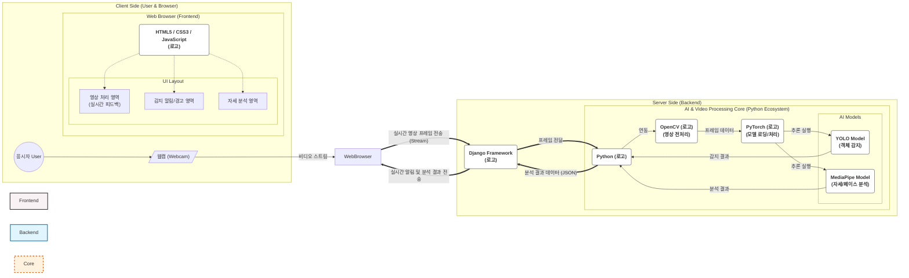

# final-report

# 시스템 아키텍처

아래는 프로젝트의 시스템 아키텍처 다이어그램입니다.

```mermaid
graph LR
    subgraph "Client Side (User & Browser)"
        User((응시자 User))
        WebCam[/"웹캠 (Webcam)"/]
        
        subgraph "Web Browser (Frontend)"
            style Frontend fill:#f9f2f4,stroke:#333,stroke-width:2px
            HTML_CSS_JS("HTML5 / CSS3 / JavaScript\n(로고)")
            
            subgraph "UI Layout"
                VideoArea["영상 처리 영역\n(실시간 피드백)"]
                AlertArea["감지 알림/경고 영역"]
                PostureArea["자세 분석 영역"]
            end
        end
    end

    User --> WebCam
    WebCam -->|비디오 스트림| WebBrowser

    subgraph "Server Side (Backend)"
        style Backend fill:#e1f5fe,stroke:#0277bd,stroke-width:2px
        
        Django("Django Framework\n(로고)")
        
        subgraph "AI & Video Processing Core (Python Ecosystem)"
            style Core fill:#fff3e0,stroke:#e65100,stroke-width:2px,stroke-dasharray: 5 5
            PythonLang("Python (로고)")
            OpenCV("OpenCV (로고)\n(영상 전처리)")
            PyTorch("PyTorch (로고)\n(모델 로딩/처리)")
            
            subgraph "AI Models"
                YOLO("YOLO Model\n(객체 감지)")
                MediaPipe("MediaPipe Model\n(자세/페이스 분석)")
            end
            
            PythonLang -- 연동 --> OpenCV
            OpenCV -- 프레임 데이터 --> PyTorch
            PyTorch -- 추론 실행 --> YOLO
            PyTorch -- 추론 실행 --> MediaPipe
            YOLO -- 감지 결과 --> PythonLang
            MediaPipe -- 분석 결과 --> PythonLang
        end
    end

    %% Data Flow
    WebBrowser == "실시간 영상 프레임 전송 (Stream)" ==> Django
    Django == "프레임 전달" ==> PythonLang
    PythonLang == "분석 결과 데이터 (JSON)" ==> Django
    Django == "실시간 알림 및 분석 결과 전송" ==> WebBrowser

    %% Internal UI flow
    HTML_CSS_JS -.-> VideoArea
    HTML_CSS_JS -.-> AlertArea
    HTML_CSS_JS -.-> PostureArea

    %% Styling for better visuals in mermaid
    classDef logo fill:#fff,stroke:#333,stroke-width:1px,font-weight:bold;
    class Django,PythonLang,OpenCV,PyTorch,YOLO,MediaPipe,HTML_CSS_JS logo;
```

